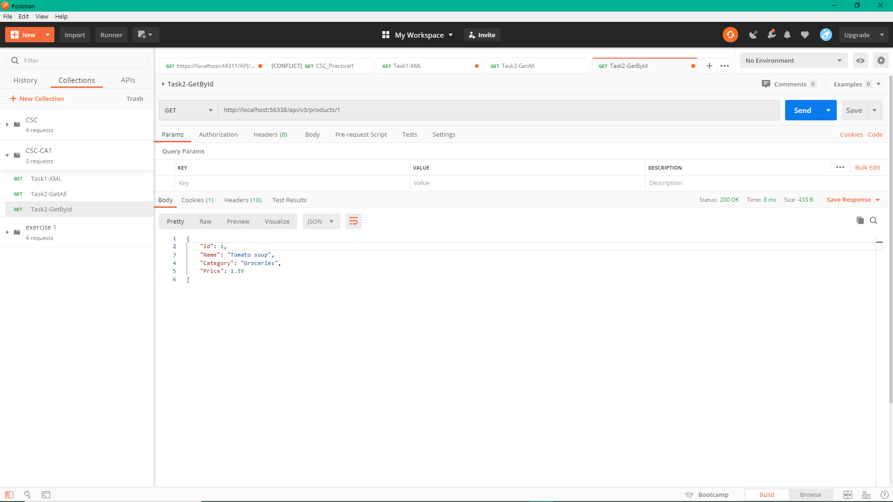
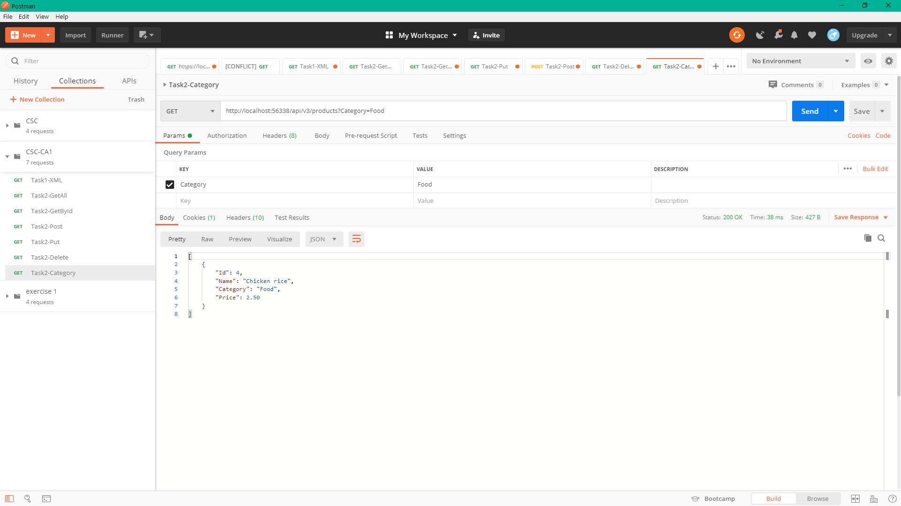
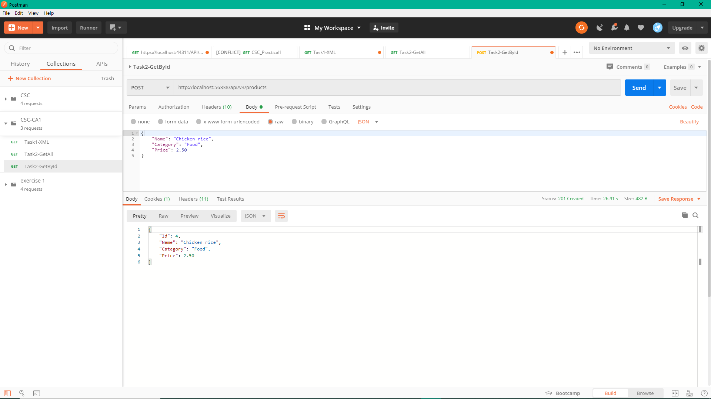
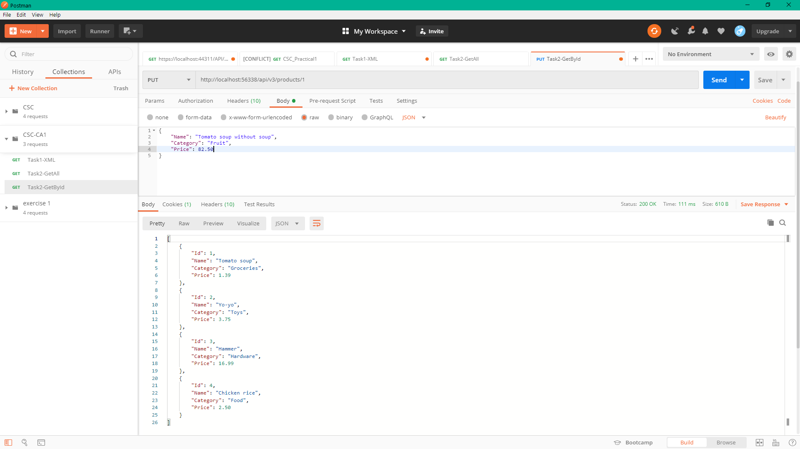
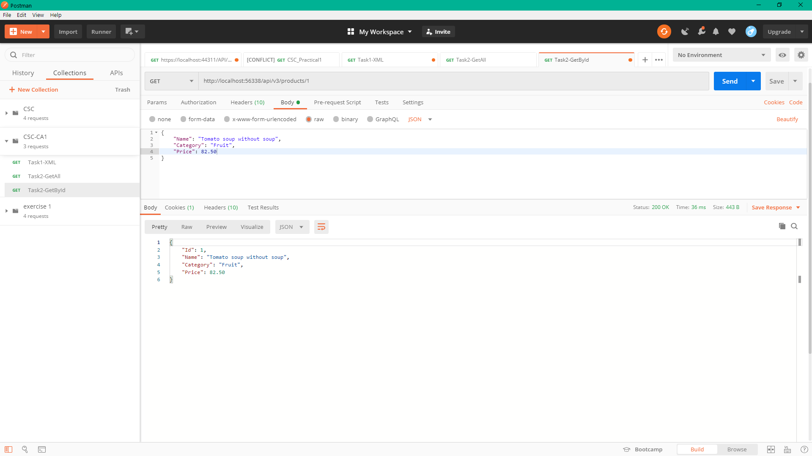
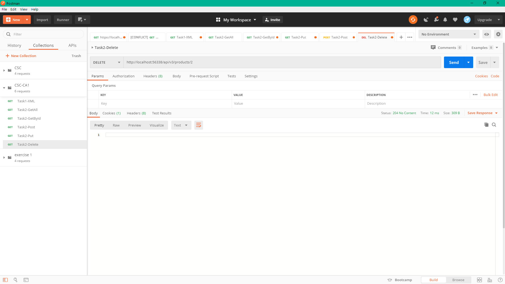
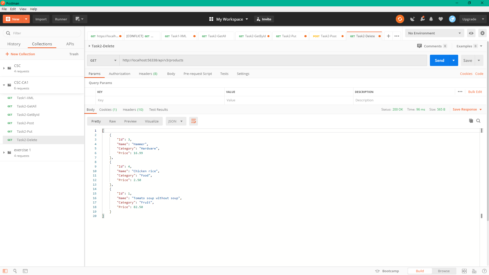

# t2 

Pang Jing Hui | P1845259

## Web API Document
| No. | HTTP Method  | Route | Description |
| ------------- | ------------- | ------------- | ------------- |
| 1. | GET  | api/v3/products  | Retrieve all the data.  |
| 2. | GET  | api/v3/products/{id:int:min(1)}  | Retrieve data based on id. Route constraints let you restrict how the parameters in the route template are matched. The general syntax is "{parameter:constraint}". Constraints on URL parameters. We can even restrict the template placeholder to the type of parameter it can have. For example, we can restrict that the request will be only served if the id is greater than 1. Otherwise the request will not work.   |
| 3. | GET  | api/v3/products?category={category}  | Retrieve the data by cateogry   |
| 4. | POST  | api/v3/products  | Create/add a new data. NOTES: Response code: By default, the Web API framework sets the response status code to 200 (OK). But according to the HTTP/1.1 protocol, when a POST request results in the creation of a resource, the server should reply with status 201 (Created). Location: When the server creates a resource, it should include the URI of the new resource in the Location header of the response.  |
| 5. | PUT  | api/v3/products/{id:int}  | Update/edit a data. The general syntax is "id:int" where the id must be integer.  |
| 6. | DELETE  | api/v3/products/{id:int}  | Delete/remove a data. Applied same restriction.   |

## Postman testing screenshots of CRUD:
### 1. GET - Retrieve all products

### 2. GET - Retrieve product by ID

### 3. GET - Retrieve product by Category

### 4. POST - Create product
#### JSON data: 

#### After POST:

### 5. PUT - Update product
#### JSON data:

#### After PUT:

### 6. DELETE - Delete product by ID
#### URL Parameter:

#### After DELETE:

## Postman testing screenshots of underposting & overposting:
### Underposting - missing properties:
#### Without name:
#### Without price:

### Underposting - Out of range:
#### Negative input:
#### Out of range input:

### Overposting - non existing data:
#### Discount property which does not exist:

